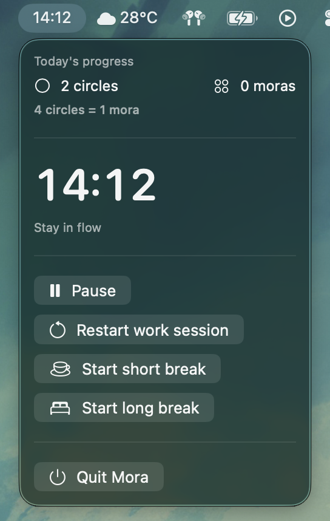

# Mora

Minimalist macOS menu bar focus timer with configurable Pomodoro cycles, full-screen break overlays, and lightweight daily progress tracking.

Mora is currently a **preview release**. The core timer, break, sound, progress, and shortcut flows are present, but preferences, idle handling, signing, and UX polish are still being shaped.

## Download

Latest release: [Mora 1.3](https://github.com/aliffrhn/mora/releases/tag/v1.3)

- Download: [Mora-1.3.dmg](https://github.com/aliffrhn/mora/releases/download/v1.3/Mora-1.3.dmg)
- Version: `1.3` (`CFBundleVersion` `4`)
- macOS: 13+
- Architecture: universal macOS build (`arm64` + `x86_64`)
- SHA-256: `f12d84c3c7de884a4e8812a4c1b66891b2123eaa3cfd60b4020344f5263377cc`

Open the DMG and drag `Mora.app` into `/Applications`.

This build is not Developer ID signed or notarized yet. macOS may block the first launch; if you trust this build, allow it from **System Settings > Privacy & Security**.

## Features

- Menu bar first: start, pause, resume, restart, and quit without managing an app window.
- Configurable focus, short-break, and long-break durations with 25/5/15 defaults.
- Full-screen break overlays on every display with countdown and skip/dismiss controls.
- Daily progress for today's circles, four-step mora progress, and banked moras.
- Chimes for focus end, break end, and cycle completion, with a sound toggle.
- Global shortcuts for the main timer commands.
- Early idle auto-pause plumbing for keyboard/mouse inactivity, with more controls still pending.

## Keyboard Shortcuts

| Shortcut | Action |
| --- | --- |
| `Shift` + `Command` + `S` | Start or resume |
| `Shift` + `Command` + `P` | Pause |
| `Shift` + `Command` + `R` | Restart work session |
| `Shift` + `Command` + `K` | Skip break |

## Screenshots

Current menu bar panel: today's circles/moras, live countdown, timer controls, break actions, and quit.



## Privacy & Permissions

Mora stores timer state, progress, and preferences locally in macOS `UserDefaults`.

Idle auto-pause uses local keyboard/mouse inactivity signals. Mora does not include analytics, accounts, cloud sync, or telemetry upload.

## Known Limitations

- Not notarized yet, so first launch may require manual approval in macOS security settings.
- Preferences currently cover sound and timer durations; idle controls are not yet exposed in the UI.
- Idle auto-pause has service/state support, but threshold and enable controls still need user-facing UI.
- Error handling and edge-case polish are still WIP.

## Build From Source

Requirements:

- macOS 13+
- Xcode 26+ / Swift 6.2+
- SwiftPM dependency resolution for [`HotKey`](https://github.com/soffes/HotKey)

Recommended local run:

1. `swift package resolve`
2. `open Mora.xcodeproj`
3. Run the `Mora` scheme from Xcode.

Developer smoke path:

```sh
./script/build_and_run.sh
```

For app-like behavior, prefer Xcode, `./script/build_and_run.sh`, or an installed `.app` bundle over raw `swift run`.

## Tests

```sh
swift test
```

The Xcode project also includes the `Mora` and `MoraSnapshotTests` schemes.

## Tech Stack

- Swift 6.2+
- AppKit + SwiftUI menu bar app
- Combine for state propagation
- [`HotKey`](https://github.com/soffes/HotKey) for global shortcuts
- `UserDefaults` for lightweight local persistence

## Roadmap

1. Polish the `v1.0` preview release path: signing, notarization, and repeatable DMG packaging.
2. Add richer preferences: idle threshold, idle enable/disable, and autostart.
3. Improve return-from-idle UX and progress correction flows.
4. Add progress summaries and usability polish from real usage feedback.
